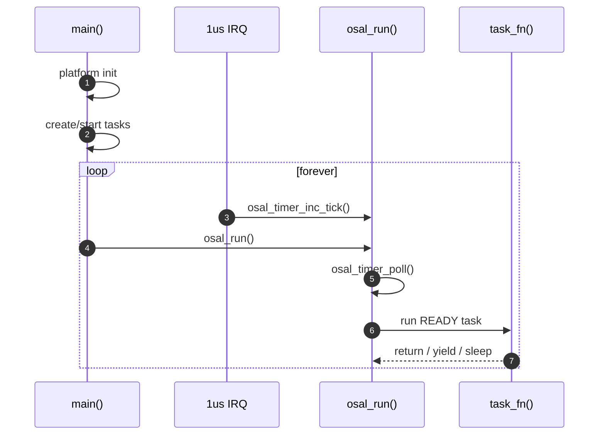

# rivers_osal
一个适用于32位MCU裸机的小型系统，旨在快速搭建系统环境

轻量级 MCU 裸机 OSAL（Operating System Abstraction Layer）工程。

> 面向 STM32 / GD32 / N32 等 32-bit MCU，提供一套“协作式调度 + 时间基 + 消息通信 + 外设桥接”的可移植骨架。

---

## 项目目标

`rivers_osal` 的目标不是实现完整 RTOS，而是提供可快速落地的中间层：

- 用统一 API 组织任务、队列、事件、互斥、定时器与内存。
- 用组件桥接隔离芯片 HAL/SDK 差异。
- 保留裸机项目的可控性（内存、执行路径、时延行为）。

---

## 当前代码实现的关键事实

### 1) 任务调度：协作式（非抢占）
- 任务状态机：`READY / RUNNING / BLOCKED / SUSPENDED`。
- `osal_run()` 每轮扫描任务链表并执行 `READY` 任务。
- 任务不切栈、不抢占，任务函数应短执行并主动 `yield/sleep`。

### 2) 时间模型：1us tick 驱动
- 平台层中断每 1us 调用 `osal_timer_inc_tick()`。
- OSAL 内部维护 us/ms 时间与软件定时器。
- `osal_timer_poll()` 在 `osal_run()` / `osal_task_yield()` 中被调用。

### 3) 队列模型：固定项大小环形队列
- 支持 `create`（走 `osal_mem`）与 `create_static`（用户缓冲区）。
- 支持非阻塞、超时等待、ISR 场景接口。

### 4) 内存模型：统一静态堆 + 可选内存池
- `osal_mem` 使用 first-fit + 相邻块合并。
- `osal_mempool` 用固定块 free-list，适合稳定对象分配。

### 5) 外设桥接：UART / Flash
- `periph_uart`：最小桥接接口为 `write_byte`，可绑定 `fputc` 控制台。
- `periph_flash`：统一擦写读接口，支持按对齐宽度（8/16/32/64）自动选择写入路径。

---

## 仓库结构

```text
.
├── middleware/
│   └── osal/
│       ├── system/
│       │   ├── Inc/                  # OSAL 核心头文件
│       │   └── Src/                  # OSAL 核心实现
│       ├── components/
│       │   └── periph/
│       │       ├── usart/            # UART 桥接组件
│       │       └── flash/            # Flash 桥接组件
│       ├── examples/
│       │   └── stm32f4/              # STM32F4 集成示例
│       ├── PORTING_GUIDE.md
│       ├── USAGE_EXAMPLES.md
│       ├── CHANGELOG.md
│       ├── DEEP_DIVE.md
│       └── README.md                 # OSAL 子模块文档
├── LICENSE
└── README.md
```

---

## 运行路径（最小理解）



---

## 快速开始（建议顺序）

1. 阅读 `middleware/osal/README.md`（子系统总览）。
2. 阅读 `middleware/osal/PORTING_GUIDE.md`（平台移植要点）。
3. 参考 `middleware/osal/examples/stm32f4/osal_integration_stm32f4.c`（完整主循环接入）。
4. 按 `middleware/osal/USAGE_EXAMPLES.md` 组织自己的任务与队列。

---

## 接入示例（节选）

```c
int main(void)
{
    platform_init();
    osal_platform_init();
    osal_platform_tick_start();

    app_create_tasks();

    while (1) {
        osal_run();
    }
}
```

---

## 适用场景

- 希望从 super-loop 过渡到更结构化的裸机架构。
- 需要跨平台迁移，但不想过早绑定某 RTOS 生态。
- 希望把 HAL 差异限制在桥接层，而不是散落在业务代码。

---

## 后续可演进方向

- 引入可选优先级调度策略（在保持现有协作模型基础上兼容）。
- 增加 host 侧单元测试（queue/mem/timer）。
- 补充性能指标（最大调度周期、queue 延迟、timer 漂移）。

---

## License

[MIT](./LICENSE)
